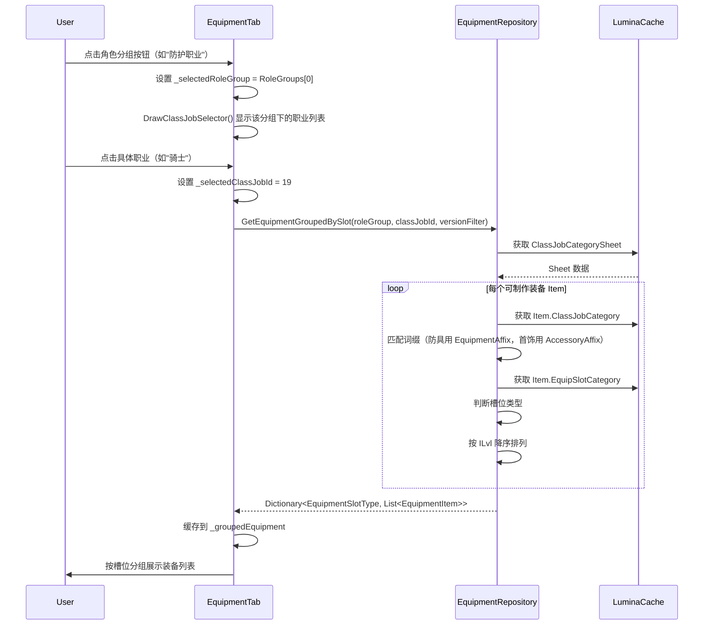
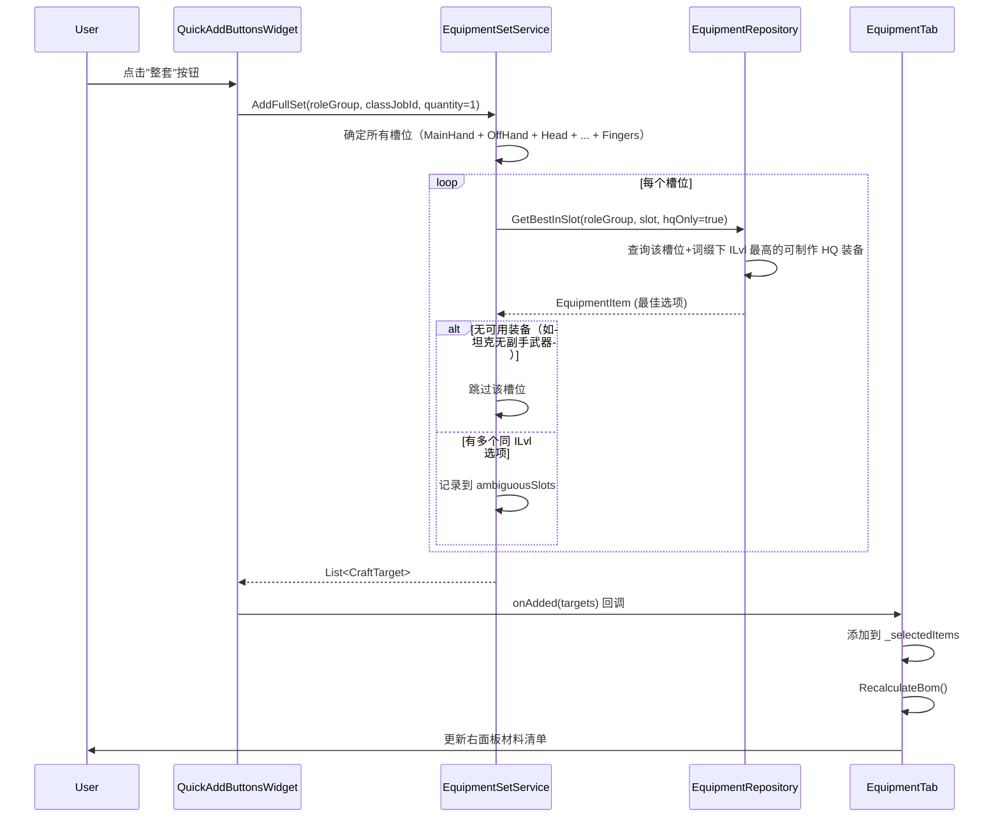
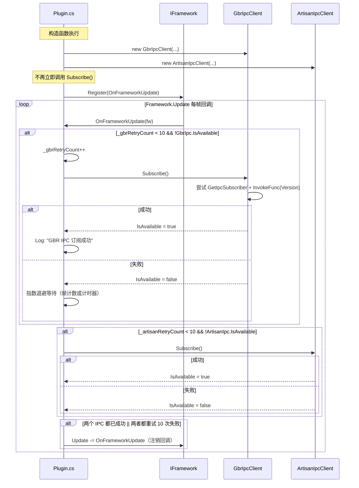
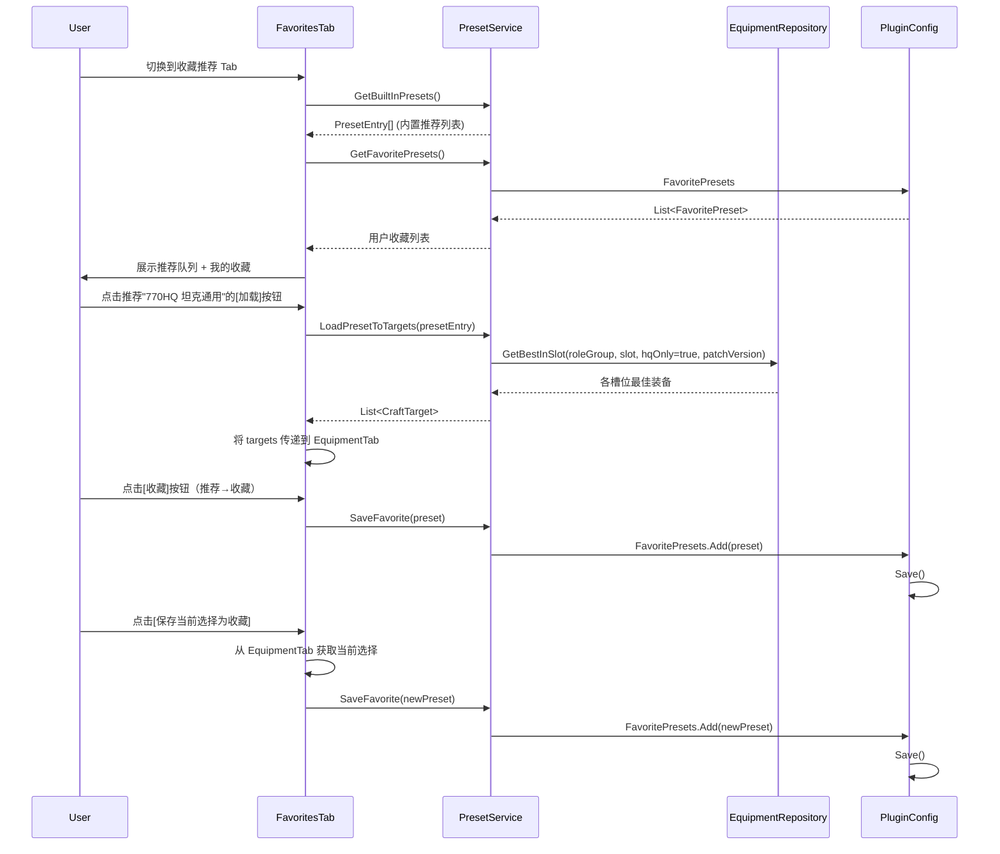
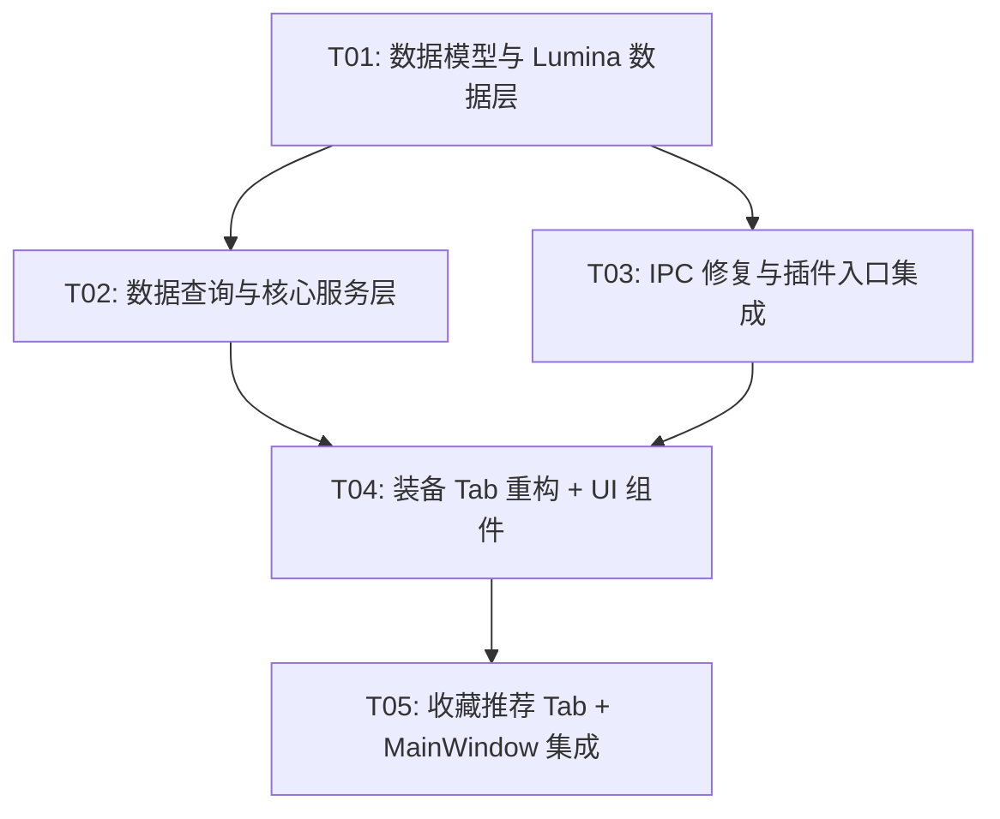

# CraftFlow v2.0 系统架构设计

## 1. 实现方案 + 框架选型

### 1.1 核心技术挑战

| 挑战 | 说明 | 解决方案 |
|---|---|---|
| 装备按词缀筛选 | FF14 装备按 ClassJobCategory 分组（fending/healing/maiming 等），需要通过 Lumina ClassJobCategory.Name 字段匹配词缀 | 在 LuminaCache 中新增 ClassJobCategorySheet 和 EquipSlotCategorySheet 缓存，构建 词缀→CategoryId 索引，按词缀筛选 Item |
| 装备槽位检测 | Item 的 EquipSlotCategory 决定其所属槽位（主手/副手/头/身等） | 加载 EquipSlotCategory Sheet，通过布尔字段（MainHand/OffHand/Head 等）映射到 EquipmentSlotType 枚举 |
| 一键添加默认选择 | 同槽位可能有多个可选装备（不同 ILvl） | 默认选最高 ILvl 的 HQ 版本；同 ILvl 多选项加入 `_ambiguousSlots` 供用户二次选择 |
| GBR IPC 时序问题 | 插件构造函数中立即调用 Version()，GBR 可能未加载 | 改用 Framework.Update 延迟重试 + 指数退避，最多 10 次 |
| 水晶/晶簇过滤 | MaterialAggregator 当前不过滤水晶 | 优先按 ItemUICategory RowId=59 过滤，名称含"晶簇"作 fallback |
| 推荐队列动态查询 | 硬编码 ItemId 随版本失效 | 按 ItemLevel + ClassJobCategory词缀 + IsHq 动态查询 |

### 1.2 框架与库选型

| 组件 | 选型 | 理由 |
|---|---|---|
| UI 框架 | ImGui (Dalamud 内置) | Dalamud 插件标准，即时模式渲染，所有现有代码已使用 |
| 数据源 | Lumina (Dalamud 内置) | FF14 游戏数据标准访问方式，已大量使用 |
| 配置持久化 | Dalamud IPluginConfiguration | 现有 PluginConfig 已实现，收藏合并到同一配置类 |
| IPC 通信 | Dalamud ICallGateSubscriber | 现有 GBR/Artisan IPC 均基于此，无需更换 |

### 1.3 架构模式

沿用现有的分层架构：

```
UI 层 (Tabs/Widgets)
  ↓ 调用
服务层 (Services: EquipmentSetService, PresetService, MaterialAggregator)
  ↓ 调用
数据层 (Data/GameData: EquipmentRepository, RecipeRepository, LuminaCache)
  ↓ 读取
Lumina 游戏数据
```

新增 EquipmentRepository 作为装备查询的专用入口，与 RecipeRepository（配方查询）职责分离。

### 1.4 数据查询方案：通过 Lumina 按词缀筛选装备

核心流程：

1. **加载 ClassJobCategory Sheet**：在 `LuminaCache.Init()` 中新增加载，构建 `Name → RowId` 的索引
2. **加载 EquipSlotCategory Sheet**：在 `LuminaCache.Init()` 中新增加载，构建槽位映射
3. **EquipmentRepository 查询逻辑**：
   - 接收 RoleGroup（含 EquipmentAffix 和 AccessoryAffix）
   - 遍历 ItemSheet 中有配方的装备
   - 对每个 Item，检查其 `ClassJobCategory` 的 Name 字段是否匹配词缀
   - 防具类槽位（头/身/手/腿/足）用 EquipmentAffix 匹配
   - 首饰类槽位（耳/颈/腕/指）用 AccessoryAffix 匹配
   - 武器类槽位（主手/副手）额外检查具体 ClassJobId（能工巧匠需按职业细分）
   - 通过 EquipSlotCategory 判断所属槽位

---

## 2. 文件列表及相对路径

### 2.1 新建文件

| 文件路径 | 职责 |
|---|---|
| `Data/Models/RoleGroup.cs` | 角色分组定义（9 个分组 + 词缀映射） |
| `Data/Models/EquipmentItem.cs` | 装备项数据模型（含槽位类型、ILvl、HQ 标记） |
| `Data/Models/FavoritePreset.cs` | 收藏预设数据模型 + 内置推荐预设定义 |
| `Data/GameData/EquipmentRepository.cs` | 装备查询仓库（按词缀/槽位/版本筛选） |
| `Services/EquipmentSetService.cs` | 一键添加整套装备逻辑 |
| `Services/PresetService.cs` | 收藏/推荐预设管理服务 |
| `UI/Tabs/FavoritesTab.cs` | 收藏推荐 Tab 页面 |
| `UI/Widgets/EquipmentSlotGroupWidget.cs` | 装备槽位分组展示组件 |
| `UI/Widgets/QuickAddButtonsWidget.cs` | 一键添加按钮组组件 |

### 2.2 修改文件

| 文件路径 | 修改内容 |
|---|---|
| `Data/Models/Enums.cs` | 新增 EquipmentSlotType 枚举、AddSlotType 枚举 |
| `Data/GameData/LuminaCache.cs` | 新增 ClassJobCategorySheet、EquipSlotCategorySheet 缓存 + 索引 |
| `Data/GameData/RecipeRepository.cs` | 新增 GetEquipmentByAffix 辅助方法 |
| `Config/PluginConfig.cs` | 新增 FavoritePresets、ShowCrystals 属性 |
| `Services/MaterialAggregator.cs` | 新增水晶/晶簇过滤逻辑 + showCrystals 参数 |
| `IPC/GbrIpcClient.cs` | 新增 DelayedSubscribe 方法，支持延迟重试 |
| `IPC/IpcAvailabilityChecker.cs` | 移除构造函数内立即重试逻辑 |
| `Plugin.cs` | 注入 IFramework，实现延迟 IPC 订阅；新增服务实例化 |
| `UI/Tabs/EquipmentTab.cs` | 完整重构：三级选择流程 + 槽位分组 + 一键添加 |
| `UI/MainWindow.cs` | 新增 FavoritesTab；传递新依赖 |
| `UI/Widgets/MaterialListWidget.cs` | 新增"显示水晶"切换复选框 |

---

## 3. 数据结构和接口（类图）

```mermaid
classDiagram
    direction TB

    class RoleGroup {
        <<record>>
        +string DisplayName
        +string EnglishName
        +(uint ClassJobId, string Name)[] Jobs
        +string EquipmentAffix
        +string AccessoryAffix
    }

    class EquipmentSlotType {
        <<enumeration>>
        MainHand
        OffHand
        Head
        Body
        Hands
        Legs
        Feet
        Ears
        Neck
        Wrists
        Fingers
    }

    class AddSlotType {
        <<enumeration>>
        WeaponOnly
        ArmorOnly
        AccessoryOnly
        ArmorAndAccessory
        FullSet
    }

    class EquipmentItem {
        +uint ItemId
        +string ItemName
        +EquipmentSlotType SlotType
        +int ItemLevel
        +bool IsHq
        +int Quantity
    }

    class EquipmentSlotGroup {
        <<record>>
        +string DisplayName
        +EquipmentSlotType[] Slots
    }

    class FavoritePreset {
        +string Name
        +List~EquipmentSelection~ Selections
        +DateTime CreatedAt
    }

    class EquipmentSelection {
        +uint ItemId
        +string ItemName
        +int Quantity
    }

    class PresetEntry {
        <<record>>
        +string DisplayName
        +string EquipmentAffix
        +string AccessoryAffix
        +int ItemLevel
        +bool IsHq
        +bool IncludeWeapon
    }

    class EquipmentRepository {
        -LuminaCache _cache
        -IPluginLog _log
        +GetEquipmentByRoleAndSlot(RoleGroup, uint classJobId, EquipmentSlotType slot, int~? patchVersion) List~EquipmentItem~
        +GetEquipmentGroupedBySlot(RoleGroup, uint classJobId, int~? patchVersion) Dictionary~EquipmentSlotType, List~EquipmentItem~~
        +GetBestInSlot(RoleGroup, EquipmentSlotType slot, bool hqOnly, int~? patchVersion) EquipmentItem~
        +GetSlotTypeForItem(Item item) EquipmentSlotType
        +IsAccessorySlot(EquipmentSlotType slot) bool
    }

    class EquipmentSetService {
        -EquipmentRepository _equipRepo
        -RecipeRepository _recipeRepo
        -IPluginLog _log
        +AddWeaponSet(RoleGroup, uint classJobId, int quantity) List~CraftTarget~
        +AddArmorSet(RoleGroup, uint classJobId, int quantity) List~CraftTarget~
        +AddAccessorySet(RoleGroup, uint classJobId, int quantity) List~CraftTarget~
        +AddArmorAndAccessorySet(RoleGroup, uint classJobId, int quantity) List~CraftTarget~
        +AddFullSet(RoleGroup, uint classJobId, int quantity) List~CraftTarget~
        +AddByType(RoleGroup, uint classJobId, AddSlotType type, int quantity) List~CraftTarget~
    }

    class PresetService {
        -EquipmentRepository _equipRepo
        -PluginConfig _config
        -IPluginLog _log
        +GetBuiltInPresets() PresetEntry[]
        +GetFavoritePresets() List~FavoritePreset~
        +SaveFavorite(FavoritePreset preset) void
        +DeleteFavorite(string name) void
        +RenameFavorite(string oldName, string newName) void
        +LoadPresetToTargets(PresetEntry preset) List~CraftTarget~
        +LoadPresetToTargets(FavoritePreset preset) List~CraftTarget~
    }

    class LuminaCache {
        +Dictionary~uint, Item~ ItemSheet
        +Dictionary~uint, Recipe~ RecipeSheet
        +Dictionary~uint, List~Recipe~~ RecipeByResultItem
        +Dictionary~uint, ClassJob~ ClassJobSheet
        +Dictionary~uint, ItemUICategory~ ItemUICategorySheet
        +Dictionary~uint, ClassJobCategory~ ClassJobCategorySheet [NEW]
        +Dictionary~uint, EquipSlotCategory~ EquipSlotCategorySheet [NEW]
        +Dictionary~string, uint~ ClassJobCategoryByName [NEW]
        +Init() void
        +GetItemName(uint itemId) string
    }

    class MaterialAggregator {
        -RecipeRepository _recipeRepo
        -LuminaCache _cache
        -IPluginLog _log
        -const uint CrystalUICategoryId = 59
        +Aggregate(BomNode root, bool showCrystals) List~MaterialEntry~
        -WalkLeaves(BomNode, Dictionary, bool) void
        -IsCrystalOrCluster(MaterialEntry) bool
    }

    class GbrIpcClient {
        +bool IsAvailable
        +Subscribe() void
        +DelayedSubscribe(IFramework framework) void [NEW]
        +Identify(string text) uint
        +GetVersion() int
        +Dispose() void
    }

    class PluginConfig {
        +int Version
        +int DefaultVersion
        +bool ShowCrystals [NEW]
        +List~FavoritePreset~ FavoritePresets [NEW]
        +Save() void
    }

    class EquipmentTab {
        -EquipmentRepository _equipRepo
        -EquipmentSetService _setService
        -BomExpander _bomExpander
        -MaterialAggregator _materialAggregator
        -RecipeRepository _recipeRepo
        -RoleGroup? _selectedRoleGroup
        -uint _selectedClassJobId
        -Dictionary~EquipmentSlotType, List~EquipmentItem~~ _groupedEquipment
        -List~CraftTarget~ _selectedItems
        -int _versionFilter
        +DrawLeftPanel() void
        +DrawRightPanel() void
        -DrawRoleGroupSelector() void
        -DrawClassJobSelector() void
        -DrawEquipmentBySlot() void
        -RefreshEquipmentList() void
        -RecalculateBom() void
    }

    class FavoritesTab {
        -PresetService _presetService
        -EquipmentRepository _equipRepo
        -IPluginLog _log
        +DrawLeftPanel() void
        +DrawRightPanel() void
        -DrawBuiltInPresets() void
        -DrawFavoritePresets() void
    }

    class QuickAddButtonsWidget {
        -EquipmentSetService _setService
        +Draw(RoleGroup?, uint classJobId, Action~List~CraftTarget~~ onAdded) void
    }

    class EquipmentSlotGroupWidget {
        -IPluginLog _log
        +Draw(EquipmentSlotGroup group, List~EquipmentItem~ items, List~CraftTarget~ selectedItems) void
    }

    RoleGroup --> EquipmentItem : filters by affix
    EquipmentRepository --> LuminaCache : queries
    EquipmentRepository --> RoleGroup : uses affix
    EquipmentRepository --> EquipmentItem : produces
    EquipmentSetService --> EquipmentRepository : queries
    EquipmentSetService --> AddSlotType : determines slots
    EquipmentSetService --> CraftTarget : produces
    PresetService --> EquipmentRepository : queries
    PresetService --> PresetEntry : loads built-in
    PresetService --> FavoritePreset : manages
    PresetService --> PluginConfig : persists
    FavoritePreset --> EquipmentSelection : contains
    EquipmentTab --> EquipmentRepository : queries
    EquipmentTab --> EquipmentSetService : adds sets
    EquipmentTab --> QuickAddButtonsWidget : contains
    EquipmentTab --> EquipmentSlotGroupWidget : contains
    MaterialAggregator --> LuminaCache : checks crystal category
    FavoritesTab --> PresetService : manages presets
```



---

## 4. 程序调用流程（时序图）

### 4.1 装备 Tab 三级选择流程



### 4.2 一键添加整套流程



### 4.3 GBR 延迟检测流程



### 4.4 收藏/推荐队列加载流程



---

## 5. 任务列表

### T01: 数据模型与 Lumina 数据层

**描述**：建立角色分组、装备槽位等核心数据模型，扩展 LuminaCache 加载 ClassJobCategory 和 EquipSlotCategory Sheet，扩展 PluginConfig 支持收藏和水晶过滤设置。

**依赖**：无

**优先级**：P0

**文件列表**：
| 文件 | 操作 | 说明 |
|---|---|---|
| `Data/Models/RoleGroup.cs` | 新建 | 9 个角色分组静态定义 + 词缀映射 |
| `Data/Models/EquipmentItem.cs` | 新建 | 装备项模型（ItemId, SlotType, ILvl, IsHq, Quantity） |
| `Data/Models/FavoritePreset.cs` | 新建 | 收藏预设模型 + EquipmentSelection + 内置 PresetEntry 定义 |
| `Data/Models/Enums.cs` | 修改 | 新增 EquipmentSlotType、AddSlotType 枚举 |
| `Data/GameData/LuminaCache.cs` | 修改 | 新增 ClassJobCategorySheet、EquipSlotCategorySheet 缓存 + ClassJobCategoryByName 索引 |
| `Config/PluginConfig.cs` | 修改 | 新增 ShowCrystals、FavoritePresets 属性，更新 Load() |

---

### T02: 数据查询与核心服务层

**描述**：新建 EquipmentRepository 实现按词缀/槽位/版本的装备查询；新建 EquipmentSetService 实现一键添加整套逻辑；新建 PresetService 实现收藏/推荐管理；修改 MaterialAggregator 支持水晶过滤。

**依赖**：T01

**优先级**：P0

**文件列表**：
| 文件 | 操作 | 说明 |
|---|---|---|
| `Data/GameData/EquipmentRepository.cs` | 新建 | 装备查询仓库（按词缀/槽位/版本筛选，GetBestInSlot） |
| `Data/GameData/RecipeRepository.cs` | 修改 | 新增辅助方法，移除 GetEquipmentByClassJob（被 EquipmentRepository 替代） |
| `Services/EquipmentSetService.cs` | 新建 | 一键添加整套逻辑（5 种 AddSlotType） |
| `Services/PresetService.cs` | 新建 | 收藏/推荐预设管理（CRUD + 动态查询加载） |
| `Services/MaterialAggregator.cs` | 修改 | 新增 showCrystals 参数 + IsCrystalOrCluster 过滤逻辑 |

---

### T03: IPC 修复与插件入口集成

**描述**：修复 GBR IPC 延迟检测问题，在 Plugin.cs 中注入 IFramework 实现延迟订阅，更新 IpcAvailabilityChecker 移除冗余重试逻辑。

**依赖**：T01

**优先级**：P0

**文件列表**：
| 文件 | 操作 | 说明 |
|---|---|---|
| `IPC/GbrIpcClient.cs` | 修改 | 新增 DelayedSubscribe 方法，分离订阅与验证逻辑 |
| `IPC/IpcAvailabilityChecker.cs` | 修改 | 移除构造函数内立即重试逻辑，依赖延迟机制 |
| `Plugin.cs` | 修改 | 注入 IFramework，实现 OnFrameworkUpdate 延迟 IPC 订阅 + 指数退避 |

---

### T04: 装备 Tab 重构 + UI 组件

**描述**：完全重构 EquipmentTab 为三级选择流程（角色分组→职业→槽位分组），新建 EquipmentSlotGroupWidget 和 QuickAddButtonsWidget，修改 MaterialListWidget 增加"显示水晶"切换。

**依赖**：T01, T02, T03

**优先级**：P0

**文件列表**：
| 文件 | 操作 | 说明 |
|---|---|---|
| `UI/Tabs/EquipmentTab.cs` | 修改（重写） | 三级选择流程 + 槽位分组展示 + 版本筛选 |
| `UI/Widgets/EquipmentSlotGroupWidget.cs` | 新建 | 装备槽位分组展示组件（头/耳、身/颈等配对显示） |
| `UI/Widgets/QuickAddButtonsWidget.cs` | 新建 | 5 种一键添加按钮组件 |
| `UI/Widgets/MaterialListWidget.cs` | 修改 | 新增"显示水晶"复选框 + 传递 showCrystals 到 Aggregator |

---

### T05: 收藏推荐 Tab + MainWindow 集成

**描述**：新建 FavoritesTab 实现收藏/推荐 UI，修改 MainWindow 集成新 Tab 和新依赖，完成端到端集成。

**依赖**：T01, T02, T03, T04

**优先级**：P1

**文件列表**：
| 文件 | 操作 | 说明 |
|---|---|---|
| `UI/Tabs/FavoritesTab.cs` | 新建 | 收藏推荐 Tab（推荐队列 + 我的收藏 + 保存/加载/删除） |
| `UI/MainWindow.cs` | 修改 | 新增 FavoritesTab，Tab 栏增加"收藏推荐"，传递新依赖 |
| `Data/Models/Enums.cs` | 修改 | TabType 枚举新增 Favorites 值 |

---

### 任务依赖关系图



> 注意：T02 和 T03 可以并行开发（都仅依赖 T01），T04 需要两者都完成后才能进行。

---

## 6. 依赖包列表

无新增 NuGet 包。所有依赖均为 Dalamud API 15 内置：
- `Lumina` / `Lumina.Excel`：游戏数据访问
- `Dalamud.Interface` / `ImGui.NET`：UI 渲染
- `Dalamud.Plugin.Ipc`：IPC 通信

---

## 7. 共享知识（跨文件约定）

### 7.1 命名约定

| 约定 | 示例 |
|---|---|
| 新建的数据模型文件名与主类名一致 | `RoleGroup.cs` → `RoleGroup` record |
| LuminaCache 新增 Sheet 属性命名：`{SheetName}Sheet` | `ClassJobCategorySheet`, `EquipSlotCategorySheet` |
| 新增 Repository 方法命名：`Get{Entity}By{Criteria}` | `GetEquipmentByRoleAndSlot`, `GetBestInSlot` |
| EquipmentSetService 方法命名：`Add{SlotType}Set` | `AddWeaponSet`, `AddFullSet` |
| 枚举值使用 PascalCase | `EquipmentSlotType.MainHand` |
| UI 组件 ImGui ID 使用 `###` 后缀 | `"防护职业###RoleGroup_Tank"` |

### 7.2 数据流约定

| 约定 | 说明 |
|---|---|
| 所有查询经 Repository 层 | UI 不直接访问 LuminaCache，通过 EquipmentRepository / RecipeRepository 间接访问 |
| 装备筛选词缀来源 | 唯一来源为 `RoleGroup.EquipmentAffix` 和 `RoleGroup.AccessoryAffix`，不硬编码 |
| 收藏数据持久化 | 统一通过 PluginConfig.FavoritePresets，调用 PluginConfig.Save() |
| 一键添加结果类型 | 所有 AddXxxSet 方法返回 `List<CraftTarget>`，与现有制作列表无缝衔接 |
| 水晶过滤开关 | 存储在 PluginConfig.ShowCrystals，由 MaterialListWidget 读取，传递给 MaterialAggregator.Aggregate() |

### 7.3 错误处理约定

| 约定 | 说明 |
|---|---|
| IPC 调用 | 所有 IPC 调用使用 try-catch 包裹，失败时设 IsAvailable=false，不抛异常 |
| Lumina 查询 | 使用 `IsValid` 检查 RowRef，失败返回空集合/null，不抛异常 |
| 数据不一致 | 记录 Warning 日志，降级处理（如找不到装备则跳过该槽位） |
| GBR 延迟重试 | 最多 10 次，使用帧计数退避（1帧、2帧、4帧...），超限后停止重试并记录日志 |

### 7.4 角色分组静态数据

9 个角色分组定义在 `RoleGroup.cs` 中作为 `public static readonly RoleGroup[] RoleGroups` 数组，供全项目引用：

| 分组 | EnglishName | EquipmentAffix | AccessoryAffix | ClassJobIds |
|---|---|---|---|---|
| 防护职业 | Tank | fending | fending | 19,21,32,37 |
| 治疗职业 | Healer | healing | healing | 24,28,33,40 |
| 制敌DPS | Maiming DPS | maiming | slaying | 22,39 |
| 强袭DPS | Striking DPS | striking | slaying | 20,34 |
| 游击DPS | Scouting DPS | scouting | aiming | 30,41 |
| 远敏DPS | Ranged DPS | aiming | aiming | 23,31,38 |
| 法系DPS | Casting DPS | casting | casting | 25,27,35,42 |
| 大地使者 | Gatherer | gathering | gathering | 16,17,18 |
| 能工巧匠 | Crafter | crafting | crafting | 8-15 |

### 7.5 装备槽位分组

定义在 `EquipmentSlotGroup.cs` 中的 `public static readonly EquipmentSlotGroup[] SlotGroups` 数组：

| 分组名 | 包含槽位 |
|---|---|
| 主手/副手 | MainHand, OffHand |
| 头/耳 | Head, Ears |
| 身/颈 | Body, Neck |
| 手/腕 | Hands, Wrists |
| 腿/指 | Legs, Fingers |
| 足 | Feet |

### 7.6 水晶/晶簇过滤规则

1. 优先按 `ItemUICategory.RowId == 59`（水晶分类）过滤
2. 辅助按名称包含"晶簇"或"Crystal"过滤（不区分大小写）
3. 默认过滤（ShowCrystals=false），用户可通过复选框切换
4. 过滤发生在 `MaterialAggregator.Aggregate()` 内部，不修改 BomNode 树结构

---

## 8. 待明确事项

| # | 事项 | 影响范围 | 建议/假设 |
|---|---|---|---|
| 1 | ClassJobCategory.Name 在中文客户端下是否返回英文名（如"fending"）？ | EquipmentRepository 的词缀匹配 | Lumina 的 Name 字段通常为游戏内部名（英文），不受客户端语言影响。若返回本地化名称，需改用 RowId 匹配。**需在开发初期验证。** |
| 2 | EquipSlotCategory 的字段名是否为 MainHand/OffHand/Head 等？ | GetSlotTypeForItem 的实现 | 基于 Lumina Excel 生成的字段名，不同版本可能有差异。需验证 Lumina 源码或运行时 dump。 |
| 3 | ItemUICategory RowId=59 是否确认为"水晶"分类？ | 水晶过滤逻辑 | PRD 建议值为 59，需通过 Lumina 数据验证。若不正确，需调整为正确 RowId。 |
| 4 | 能工巧匠主副手按具体职业筛选时，ClassJobCategory 如何映射？ | EquipmentRepository 的武器筛选逻辑 | 能工巧匠的武器（主副手）Item 的 ClassJobCategory 可能包含具体职业标记（如"CRP"/"BSM"），也可能仅标记为"Crafting"。需验证数据后决定是否需要按 Item.Name 中的职业关键词二次筛选。 |
| 5 | 推荐预设（770HQ 坦克套等）的 ItemLevel 在未来版本更新后是否仍合理？ | PresetService 的动态查询 | 当前设计按 ItemLevel + 词缀 + HQ 动态查询，版本更新后 ILvl 阈值可能需要调整。建议在 PresetEntry 中增加 PatchVersion 限定。 |
| 6 | GBR 延迟检测的指数退避间隔 | Plugin.cs 的 OnFrameworkUpdate | 当前设计为帧计数退避（1/2/4/8...帧），60fps 下 10 次重试约 16 秒。是否需要改为实际时间间隔（如 0.5s/1s/2s...）？建议用 `Stopwatch` 计时更精确。 |
| 7 | FavoritesTab 与 EquipmentTab 之间的数据传递机制 | MainWindow 的 Tab 协作 | 当前设计为 FavoritesTab 加载预设后通过共享引用调用 EquipmentTab 的方法添加 CraftTarget。需确认是否需要事件/回调机制解耦。 |
